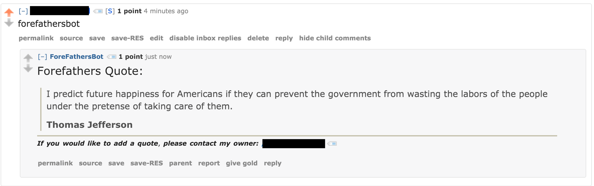

reddit-quote-bot
============

A template for a reddit bot that responds to comments that contain a a certain summon word.

The bot streams reddit comments and checks for a customizable summon word.  When that summon word is detected a quote is pulled from the quotes file and used to reply to the comment.  In the event that the bot cannot reply to the comment due to API rate limiting, the comment is queued in a MySQL database and replying will be tried again later.

#### Example Output
Here is the example output of a bot that I built using this template.  This bot is no longer in use.

### Setup

#### Database

A schema is provided for the MySQL comment queue database.  If MySQL is not installed, you must install that before proceeding.

To build the database:
`mysql -u root -p` to login

Then type `CREATE DATABASE <dbname>;` into the MySQL prompt to create a database.  You can name this whatever you want.

Then `exit` from MySQL.

Once out of the MySQL prompt type: `mysql -u root -p <dbname> < sql/botDatabase.sql` to create the tables.

#### Install decendancies

Install the MySQL library:
`pip install MySQL-python`

Install the Python Reddit API Wrapper:
`pip install praw`

#### Configure Application

All of the settings that you need access to are in the main.py file.  Each setting should have a comment explaining what it does.

#### Adding quotes

To add a quote, edit the file quotes/quotes.txt.  The quotes need to be of the form:
`This is the quote that I want to say@This is the person who said it`